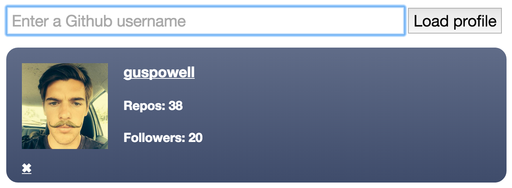

GitHub Profiles
=======================

## Introduction

An introduction to Node. We were required to setup a Node server and create a single page app that could load GitHub profiles using Ajax calls to the GitHub API.



## Technologies Used

- Javascript
- JQuery
- Ajax
- Mocha-casperjs
- HTML
- ejs
- Mustache
- CSS

## Favourite Code Snippet

```javascript
$.get('https://api.github.com/users/'+ username, function(user){
  var newProfile = Mustache.render($('#profile-template').html(), user);
  $(newProfile).appendTo('.profile-container');
  $('.profile-container').slideDown();
})
```

## Still to complete/refactor

- [ ] Tests
- [ ] Only the first profile slides down

## Takeaway

This was a very intense week in that we were introduced to so many new things. Node, Grunt, Ajax and Mustache to name a few.
